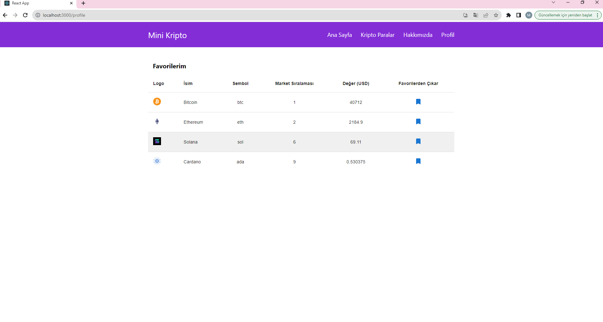

# Kripto Takip ReactJS Redux

Kullanıcıların kripto para birimlerinin güncel değerlerini takip etmelerini sağlayan bir web uygulamasıdır. Proje, ReactJS ve Redux kullanılarak geliştirilmiş olup, kullanıcı dostu bir arayüzle kripto para piyasasının anlık verilerine erişim imkanı sunar.

## Özellikler

- Kripto para birimlerinin güncel değerlerini görüntüleme
- Tüm kripto para birimlerinin detay sayfalarını inceleme
- Favorilere eklenen kripto paraları takip etme
- Grafiklerle kripto para birimlerinin fiyat değişimlerini analiz etme

## Ekran Görüntüleri

## Kurulum

Projeyi yerel makinanıza kurmak için aşağıdaki adımları izleyin:

1. Repo'yu klonlayın: `git clone <repo-bağlantısı>`
2. Proje dizinine gidin: `cd kripto-takip-reactjs-redux`
3. Bağımlılıkları yükleyin: `npm install`
4. Uygulamayı başlatın: `npm start`

## Kullanılan Teknolojiler

Bu proje, aşağıdaki teknoloji ve kütüphaneleri içermektedir:

- **ReactJS (v18.2.0):** 

- **Redux (v5.0.0):** 

- **React Router DOM (v6.18.0):** 

- **Material-UI (v5.14.18):** 

- **Recharts (v2.10.3):** 

- **Emotion (v11.11.1):** 

- **Axios (v1.6.2):** 

- **Redux Toolkit (v2.0.1):** 

